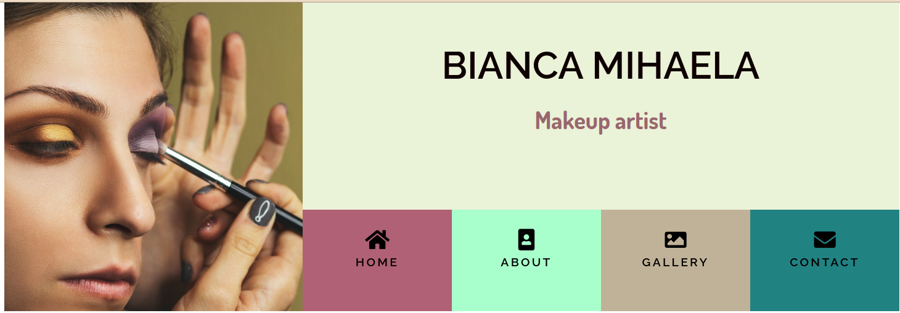

## **Table of contents**
* [Name](#name)
* [UX](#ux)
  * [User stories](#user-stories)
  * [Structure](#structure)
  * Design
* Limitations
* Features
* Technologies used
* Testing
* Deployment
* Credits
  * Content
  * Media
  * Acknowledgements

# Name
The project's name is **Bianca Mihaela makeup artist Dublin** and it was built
 using the knowledge gained within the course, for a family member living in Dublin 
 that wants to increase their clients through an online presence.

# Purpose
Bianca has been practicing makeup on various ocasions for different events,
has a Facebook page for her business and the purpose of the website is to increase 
the number of clients that reach out to her. With this in mind, the website 
was created using the mobile first approach and is fully responsive.

# UX
## User stories
1. As a potential client, I can easily and intuitively navigate across the website 
to find information;
2. As a potential client, I can easily find information about the artist's work;
3. As a potential client, I want to see video/photo about her work;
4. As a potential client/returning client, I can contact the owner to book an 
appointment;
5. As a potential client, I can sign up to a newsletter to get regular tips about 
makeup;
6. As a potential client, I can find and follow them on social media.

## Structure
For easy navigation, each page will display the navigation menu (with navigation
elements to the other pages) and footer (containing links helping to subscribe 
for a newsletter or giving the opportunity to follow on social media).  
The Home Page will show a short video presenting the work of the artist, the purpose 
of the video being to catch user's attention and make them look further.

