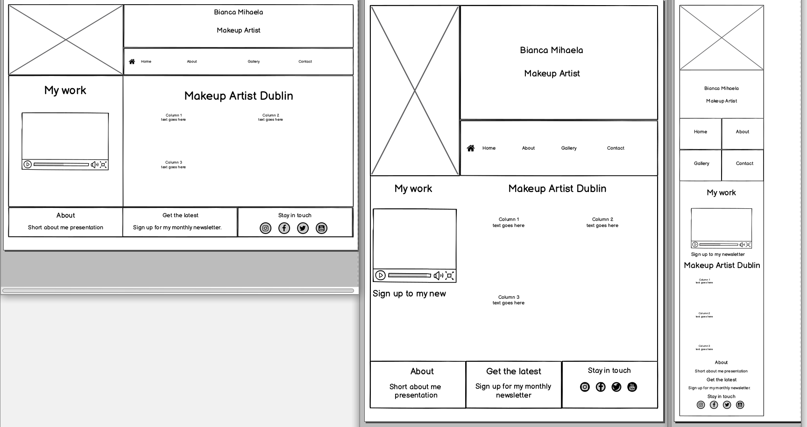

## **Table of contents**
* [Name](#project's-name)
* [Purpose](#purpose)
* [UX](#ux)
  * [User stories](#user-stories)
  * [Structure](#structure)
  * [Design](#design)
* [Limitations](#limitations)
* [Features](#features)
    * [Existing features](#existing-features)
    * [Features left to implement](#features-left-to-implement)
* [Technologies used](#technologies-used)
* [Testing](#testing)
* [Deployment](#deployment)
    * [Run project locally](#run-project-locally)
* [Credits](#credits)
  * [Code](#code)
  * [Media](#media)
  * [Acknowledgements](#acknowledgements)

# Project's Name
The project's name is **Bianca Mihaela makeup artist Dublin** and it was built
 using the knowledge gained within the course, for a family member living in Dublin 
 that wants to increase their clients through an online presence.  
 The live website can be found [here](https://stefanmdvs.github.io/bianca-makeup/).

# Purpose
Bianca has been practicing makeup on various ocasions for different events,
has a Facebook page for her business and the purpose of the website is to increase 
the number of clients that reach out to her. With this in mind, the website 
was created using the mobile first approach and is fully responsive.

# UX
## User stories
1. As a potential client, I can easily and intuitively navigate across the website 
to find information;
2. As a potential client, I can easily find information about the artist's work;
3. As a potential client, I want to see video/photo about her work;
4. As a potential client/returning client, I can contact the owner to book an 
appointment;
5. As a potential client, I can sign up to a newsletter to get regular tips about 
makeup;
6. As a potential client, I can find and follow them on social media.

## Structure
For easy navigation, each page will display the navigation menu (with navigation
elements to the other pages) and footer (containing links helping to subscribe 
for a newsletter or giving the opportunity to follow on social media).   

The *Home Page* will show a short video presenting the work of the artist, the purpose 
of the video being to catch user's attention and make them look further. It will also 
display information about the artist's work and material used as well as the 
important mention that she is also mobile.  

The *About Page* will display the address, mobile number and email 
address toghether with a short presentation about the artist, what they do and why 
clients should chose them.  

The *Gallery Page* will display a range of quality photos to highlight their work.  

The *Contact Page* will offer the possibility of sending a message to the artist by 
filling in a form.

## Design
### Colour scheme
I wanted to represent as close as possible the colours of a makeup kit. 
Using [Coolors colour scheme generator](http://www.coolors.co) 
I have uploaded the logo image and chose **Rose Dust** 
as the main colour. This colour is also used for borders, buttons and highlighting links.
 Also, giving the nature of the project, I considered that introducing colours from 
the same palette on the nav menu will make a pleasant user experience.
Header and Footer will have a **Beige** background. 
This colour will also be used for the modal background.
### Typography
The Title and headers throughout the website will use the **Raleway** font family 
while the rest of the text will use **Dosis** font family.
### Imagery
Due to professional images and video not being available at this stage, I have used the 
free online resources available on [Unsplash](https://unsplash.com/s/photos/makeup) for photos 
and the video can be found on [Coverr](https://coverr.co/videos/makeup-artist-adjusts-a-makeup-qhK3crUtyU).
### Wireframes
I have created wireframes for Desktop, tablet and mobile view for each Page.  
*Home Page*  

  

*About Page*  

  

*Gallery Page*  

  

*Contact Page*  

  

Full-size wireframes can be accessed here:
* [Home](assets/wireframes/BiancaHomeAll.pdf)
* [About](assets/wireframes/BiancaAboutAll.pdf)
* [Gallery](assets/wireframes/BiancaGalleryAll.pdf)
* [Contact](assets/wireframes/BiancaContactAll.pdf)
# Limitations
Except the Modal imported from Bootstrap, the website has been built only with 
HTML and CSS, therefore it doesn't store data or send email requests.
# Features
## Existing features
* Call to action links on Home Page sending user to:
    * Modal for joining newsletter list.
    * Contact page to fill in and submit contact form.
* Call to action on About Page:
    * Clickable phone number for easier contact.
    * Clickable email address for faster email sending.
    * Link to Contact and Gallery Pages.
* Contact form on Contact Page with text area for event description.
* Call to action link in Footer sending to Modal for joining newsletter list.

## Features left to implement
The future release should focus on implementing a Booking button that will allow users to select 
a time slot and a date for their booking.

# Technologies used
This project uses the following technologies:
* HTML5: for website's structure;
* Custom CSS: for styling the website;
* [Bootstrap](https://getbootstrap.com/): for layout and styling;
* [FontAwesome](https://fontawesome.com/): for navigation and social-links icons;
* [Google Fonts](https://fonts.google.com/): to import the two font families used throughout the project;
* [Git](https://git-scm.com/): used for version control;
* [GitHub](https://github.com/) and [GitPages](https://pages.github.com/): 
for hosting and deploying the website;
* [Balsamiq](https://balsamiq.com/wireframes/desktop/): software used to create the 
wireframes;
* [Coolors](https://coolors.co/264653-2a9d8f-e9c46a-f4a261-e76f51) and 
[Adobe Color](https://color.adobe.com/create/color-wheel): for colour picking and colour scheme;

# Testing
## Strategy
While testing the following strategy should be approached:
* website is responsive on different screen sizes;
* navigation links takes user to the right page;
* clicking on logo picture takes user to the home page;
* links to external websites open in a new tab;
* internal links takes user to the right page;
* checking the required fields have been filled up before submitting the contact form;
* checking the email address has the right format both on the modal and contact form.  

All HTML pages were checked using [W3C HTML validator](https://validator.w3.org/) and 
no errors were found.  
Also CSS was checked using [W3C CSS validator](https://jigsaw.w3.org/css-validator/) and no errors were found while testing my stylesheet.
Nevertheless, when testing by URL some errors appeared all Bootstrap related.  
Website was also tested considering the user stories:
> 1. As a potential client, I can easily and intuitively navigate across the website 
to find information.
>
Website was tested and all navigation links work well.  
>2. As a potential client, I can easily find information about the artist's work.
>
Information about the artist's work can be found on Home Page and About Page.  
>3. As a potential client, I want to see video/photo about her work.
>
Gallery page loads the pictures and the video can be played/paused.
>4. As a potential client/returning client, I can contact the owner to book an 
appointment.
>
Contact form has been tested and it requires all the fields to be filled before submitting.
>5. As a potential client, I can sign up to a newsletter to get regular tips about 
makeup.
>
The links to the modal work and it requires an email address before submitting.
>6. As a potential client, I can find and follow them on social media.
>
Links to social media open in a new tab.
## Issues found
When testing the following issues were found and fixed:
* Modal could be sent empty - fixed by adding the *required* attribute to email field;
* Contact form could be sent empty - fixed by adding the *required* attribute to all fields.

# Deployment
The project was started by creating a new repository on GitHub using the template provided 
by Code Institute. After this, the project was developed on GitPod, using `git add`, `git commit` and 
`git push` to commit changes to GitHub repository.    
The project was deployed from GitHub using GitHub Pages following these steps:
* from Settings tab, scroll down to GitHub Pages;
* select master branch as the source and Save;
* follow the link generated to access the [live website](https://stefanmdvs.github.io/bianca-makeup/).
## Run project locally
* Navigate to the GitHub [Repository](https://github.com/StefanMdvs/bianca-makeup):
* Click the Code drop down menu.
* Either Download the ZIP file, unpackage locally and open with IDE (this route ends here) OR Copy Git URL from the HTTPS dialogue box.
* Open your IDE in a directory of your choice.
* Use the 'git clone' command in terminal followed by the copied git URL.
* A clone of the project will be created locally on your machine.  
# Credits
## Code
The solution for text breaking the email string on About Page was found 
on [Css Tricks](#https://css-tricks.com/snippets/css/prevent-long-urls-from-breaking-out-of-container/).
## Media
Media used in this project can be found at:
* [Unsplash](https://unsplash.com/s/photos/makeup), for photos in Gallery section;
* [Coverr](https://coverr.co/videos/makeup-artist-adjusts-a-makeup-qhK3crUtyU), for video 
in Home section.
 ## Acknowledgements
 I have found inspiration for writing the README.md file in my peers' projects, 
 [Daisy-McG](https://github.com/Daisy-McG/MilestoneProject-1/blob/master/README.md) and 
 [Mr-Smyth](https://github.com/Mr-Smyth/eHand/blob/master/README.md).  
 Last but not least, special thanks to my mentor Spencer Barriball whose support was peerless!